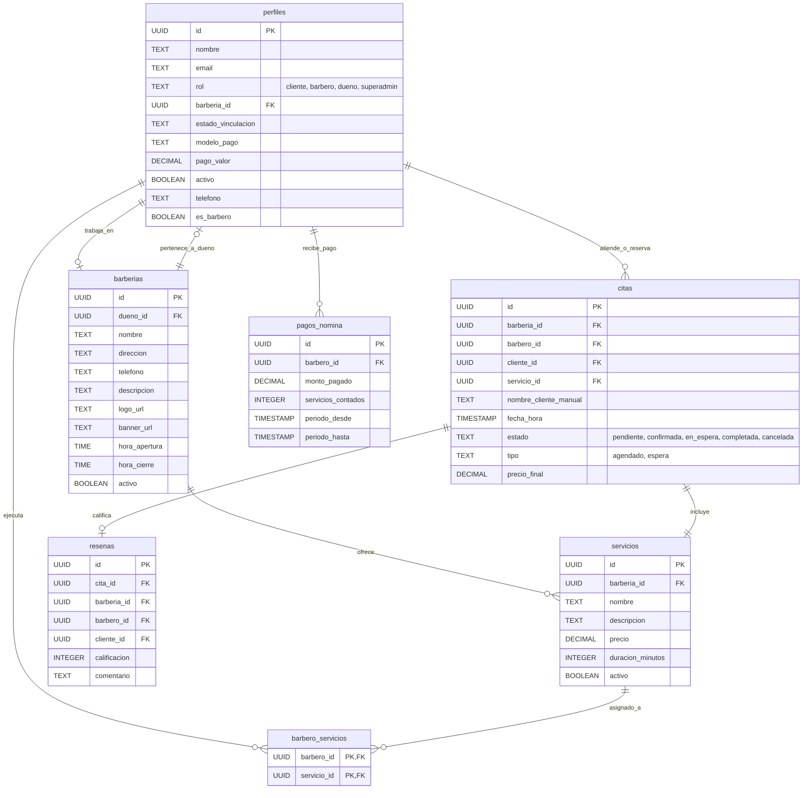

# PROYECTO: TUTURNO
## SISTEMA DE GESTIÓN Y RESERVAS EN TIEMPO REAL PARA BARBERÍAS

---

**Asignatura:**  
Desarrollo Web  

**Estudiante:**  
Esteban Daniel Suarrez Medina  

**Institución:**  
Universidad de la Costa (CUC)  

**Facultad:**  
Ingeniería de Sistemas  

**Fecha de Entrega:**  
22 de mayo de 2026  

---

## TABLA DE CONTENIDO
1. [Contexto](#1-contexto)
   - Explicación Breve
   - Problema que Resuelve
   - Solución Propuesta
   - Resultados Esperados
2. [Objetivos](#2-objetivos)
   - Objetivo General
   - Objetivos Específicos
3. [Justificación](#3-justificación)
4. [Alcance del Proyecto](#4-alcance-del-proyecto)
   - Requerimientos Funcionales
   - Requerimientos No Funcionales
5. [Herramientas y Arquitectura Tecnológica](#5-herramientas-y-arquitectura-tecnológica)
6. [Repositorio de Código](#6-repositorio-de-código)
7. [Estructura y Esquema de la Base de Datos](#7-estructura-y-esquema-de-the-base-de-datos)
   - Modelo Entidad-Relación (Mermaid Diagram)
   - Descripción Detallada de Tablas
   - Mecanismos de Seguridad y Políticas RLS
8. [Sincronización en Tiempo Real (Realtime)](#8-sincronización-en-tiempo-real-realtime)
   - Arquitectura del WebSocket de Reserva
   - Beneficio en la Experiencia de Usuario (UX)
9. [Guía de Despliegue y Configuración en Producción](#9-guía-de-despliegue-y-configuración-en-producción)
   - Estrategia de Redirecciones SPA (vercel.json)
   - Configuración de Variables de Entorno

---

## 1. CONTEXTO

### Explicación Breve
**TuTurno** es una aplicación web de última generación concebida para modernizar la forma en que las barberías gestionan sus turnos y atienden a sus clientes. La plataforma conecta a clientes, barberos y dueños de barberías en un solo ecosistema digital sincronizado en tiempo real, eliminando la necesidad de agendar por llamadas telefónicas, mensajes de WhatsApp o interminables filas de espera presenciales.

El proyecto está enfocado inicialmente en la ciudad de **Barranquilla** como piloto comercial y operativo, con una visión estratégica de expansión hacia otras ciudades de Colombia. Cuenta con tres roles principales claramente diferenciados: **dueño de barbería, barbero y cliente**, cada uno con su propio panel de control (Dashboard) y herramientas diseñadas rigurosamente según sus necesidades reales dentro de la dinámica de trabajo del negocio.

TuTurno nace como respuesta directa a una necesidad imperante del mercado local, donde la gran mayoría de barberías operan en la informalidad organizativa, perdiendo ingresos y reduciendo la fidelidad de sus clientes por la falta de una agenda confiable y ágil.

### Problema que Resuelve
Hoy en día, una gran proporción de las barberías de la región manejan sus agendas a mano, en libretas o cuadernos, o mediante conversaciones desordenadas de WhatsApp. Esta falta de digitalización acarrea problemas críticos:
*   **Cruces de Horarios indeseados:** Clientes citados exactamente a la misma hora con el mismo barbero, lo que genera malestar y daña la reputación del establecimiento.
*   **Desorganización y Estrés para el Barbero:** Los barberos inician sus jornadas sin tener claridad sobre cuántos clientes atenderán, qué servicios realizarán ni cómo optimizar sus tiempos de descanso.
*   **Falta de Control Administrativo:** El dueño de la barbería carece de herramientas para medir el rendimiento de su personal, conocer los ingresos reales diarios o mensuales, y liquidar comisiones de manera justa y transparente.
*   **Pérdida de Clientes Activos:** Usuarios que se retiran del local al ver filas extensas o que desisten de reservar porque no encuentran un canal de comunicación rápido para consultar la disponibilidad en tiempo real.

### Solución Propuesta
Una solución SaaS (Software as a Service) integral y reactiva que proporciona:
*   **Para el Cliente:** Búsqueda rápida de barberías en su zona, visualización interactiva de barberos disponibles, catálogo detallado de servicios con precios/duración, y reserva de turnos en pocos segundos (tanto para usuarios registrados como para visitantes rápidos mediante la modalidad de *Guest Booking*).
*   **Para el Barbero:** Una agenda inteligente digital que muestra en tiempo real sus turnos del día, con notificaciones instantáneas ante cualquier nuevo agendamiento o cancelación, y una vista clara de sus ingresos acumulados.
*   **Para el Dueño:** Un panel de administración total para configurar el negocio (horarios, marca, logo), añadir o retirar personal de barberos, definir servicios con sus respectivos precios, realizar cierres de caja y calcular automáticamente el pago de nómina por comisiones.

### Resultados Esperados
*   **Optimización del Agendamiento:** Reducir a cero los cruces de citas y minimizar las cancelaciones sorpresa gracias al recordatorio y validación en tiempo real.
*   **Aumento de Productividad:** Permitir que los barberos optimicen su ritmo de trabajo diario y atiendan a más clientes con mejores tiempos de respuesta.
*   **Transparencia Financiera:** Brindar a los dueños de locales estadísticas y gráficos automatizados sobre ingresos reales e históricos de nómina.
*   **Validación de Mercado:** Validar con éxito la propuesta en Barranquilla mediante retroalimentación de usuarios reales, sentando las bases tecnológicas para la escalabilidad comercial del software.

---

## 2. OBJETIVOS

### Objetivo General
Desarrollar una aplicación web completa para la gestión y reserva de turnos en barberías, que mejore la organización del negocio, optimice la agenda operativa de los barberos y brinde una experiencia de usuario cómoda, moderna y en tiempo real para el cliente final.

### Objetivos Específicos
*   **Autenticación y Roles Seguros:** Implementar un sistema de registro e inicio de sesión robusto que asigne y valide perfiles diferenciados: Dueño, Barbero y Cliente.
*   **Agenda Interactiva Realtime:** Construir un flujo de reserva intuitivo que valide la disponibilidad de horarios al instante y actualice la vista del barbero en tiempo real mediante tecnología WebSockets sin requerir recargas de página.
*   **Paneles Personalizados (Dashboards):** Diseñar interfaces optimizadas para cada rol, proveyendo al barbero una agenda organizada y al dueño herramientas de analítica.
*   **Administración SaaS:** Permitir que los administradores editen y creen catálogos de servicios, definan precios, integren nuevos barberos al staff y configuren la identidad visual de su barbería.
*   **Calificaciones y Reseñas:** Desarrollar un sistema de feedback donde los clientes califiquen la calidad de la atención recibida para fomentar la mejora continua del local.
*   **Diseño Adaptivo Premium (Mobile-First):** Construir una interfaz de usuario fluida y responsiva utilizando estándares de diseño modernos que garanticen una usabilidad idónea desde dispositivos móviles y equipos de escritorio.

---

## 3. JUSTIFICACIÓN

En el territorio colombiano, y especialmente en la ciudad de Barranquilla, el sector del cuidado personal y las barberías representa una industria de altísimo consumo y dinamismo. Sin embargo, la gran mayoría de estos establecimientos padece un estancamiento en sus procesos operativos debido al uso de herramientas analógicas o manuales.

Las alternativas comerciales de software de reservas existentes en el mercado global (como *Booksy* o *Fresha*) suelen ser inviables para el ecosistema de las barberías de barrio de Barranquilla debido a:
1.  **Costos Excesivos:** Tarifas mensuales en dólares o comisiones por reserva que afectan directamente el margen de ganancia de pequeños emprendimientos.
2.  **Flujos de Usuario Complejos:** Procesos de registro obligatorios muy rigurosos y extensos que espantan al cliente promedio local, quien busca inmediatez.

**TuTurno** rompe esta brecha. Está diseñado específicamente bajo la óptica del comportamiento y cultura del usuario local, facilitando características de "Agendamiento Rápido como Invitado" y presentando una interfaz visual atractiva, oscura con tonos dorados (*Dark & Gold Premium*), que emula el ambiente elegante de las barberías modernas. Desde el punto de vista académico y profesional, este proyecto plasma la integración de prácticas modernas de desarrollo web (arquitectura desacoplada, bases de datos reactivas y RLS de alta seguridad) en un producto real con amplio potencial comercial.

---

## 4. ALCANCE DEL PROYECTO

### Requerimientos Funcionales
*   **RF-1: Sistema de Autenticación Unificado:** Soporte seguro de inicio de sesión y registro a través de Supabase Auth, asignando roles persistentes a cada usuario.
*   **RF-2: Configuración de la Barbería:** El dueño puede registrar y parametrizar su barbería incluyendo nombre, dirección, teléfono, descripción, horarios de atención y assets de marca (logotipo y banner).
*   **RF-3: Gestión de Barberos:** Un barbero puede registrarse e ingresar el código o vinculación de la barbería a la cual pertenece para sumarse al staff del local. El dueño puede aprobar o rechazar dicha postulación.
*   **RF-4: Catálogo de Servicios:** El dueño puede crear, editar, pausar o eliminar los servicios ofrecidos, especificando costo monetario y tiempo de duración.
*   **RF-5: Motor de Agendamiento en Línea:** Flujo interactivo que permite al cliente seleccionar barbería, barbero de preferencia, servicio deseado y horario disponible dentro del rango operativo.
*   **RF-6: Validaciones en Tiempo Real (Anti-Double Booking):** El sistema impide rigurosamente que dos clientes reserven el mismo intervalo de tiempo con el mismo barbero.
*   **RF-7: Reactividad WebSocket (Realtime):** Notificación automática al panel del barbero en el momento en que se concreta una reserva, sin necesidad de actualizar la web de manera manual.
*   **RF-8: Dashboard Administrativo e Ingresos:** Panel para dueños con analíticas visuales de citas mensuales, ingresos totales estimados y liquidación de comisiones acumuladas por cada barbero según su modelo de pago (porcentaje o tarifa fija).
*   **RF-9: Historial de Citas:** Los clientes cuentan con un panel dedicado para visualizar sus citas pasadas y turnos futuros programados.
*   **RF-10: Calificación del Servicio:** El cliente tiene la opción de calificar con estrellas (1 a 5) y dejar un comentario textual sobre la calidad del servicio recibido tras concluir una cita.

### Requerimientos No Funcionales
*   **RNF-1: Seguridad e Integridad (RLS):** Implementación de políticas de Seguridad a Nivel de Fila (Row Level Security) directamente en la base de datos PostgreSQL, garantizando el aislamiento de datos.
*   **RNF-2: Velocidad de Carga:** Uso de Vue 3 (Composition API) junto a Vite, logrando tiempos de carga del lado del cliente inferiores a 1.5 segundos en la primera renderización.
*   **RNF-3: Diseño Estético Premium:** Interfaz oscura, moderna, responsiva y dotada de micro-animaciones utilizando Tailwind CSS v4 para crear una estética visual premium y profesional.
*   **RNF-4: Escalabilidad de Datos:** Estructura relacional PostgreSQL normalizada para soportar miles de registros simultáneos sin degradación de rendimiento.
*   **RNF-5: Disponibilidad:** Despliegue en la plataforma de Vercel para el Frontend y Supabase para el BaaS, asegurando un porcentaje de disponibilidad operativa de la aplicación de hasta 99.9%.

---

## 5. HERRAMIENTAS Y ARQUITECTURA TECNOLÓGICA

La aplicación ha sido desarrollada mediante una arquitectura desacoplada de alto rendimiento:

### Capa de Presentación (Frontend)
*   **Vue.js 3:** Framework progresivo en su versión más rápida y optimizada, empleando la sintaxis moderna de `Composition API` y `<script setup>`.
*   **Vue Router:** Enrutamiento reactivo del lado del cliente, administrando redirecciones complejas según el rol de la sesión activa del usuario.
*   **Tailwind CSS v4:** Motor de estilos ultra rápido centrado en CSS puro y variables nativas para layouts consistentes y adaptabilidad responsive superior.
*   **Lucide Vue Next:** Librería de iconos vectoriales interactivos de estilo minimalista.
*   **TypeScript:** Tipado estático robusto que previene errores lógicos en tiempo de compilación.

### Capa de Servicios y Persistencia (Backend as a Service)
*   **Supabase (PostgreSQL Nivel Enterprise):** Almacenamiento relacional de datos de alta integridad, manejo de claves primarias UUID, y disparadores automatizados para sincronizar credenciales con perfiles.
*   **Supabase Realtime:** Protocolo basado en canales WebSockets que replica cualquier cambio (`INSERT`, `UPDATE`, `DELETE`) en las citas hacia los paneles abiertos de los barberos.
*   **Supabase Auth:** Manejo de registro de usuarios y seguridad criptográfica de contraseñas con tokens JWT.

### Herramientas de Desarrollo y DevOps
*   **Vite:** Servidor de desarrollo instantáneo y empaquetador optimizado para la compilación de archivos estáticos.
*   **Git & GitHub:** Sistema de control de versiones distribuido para la trazabilidad y resguardo de la base de código.
*   **Vercel:** Nube de alojamiento para aplicaciones web modernas (Single Page Applications) con integración directa a GitHub.

---

## 6. REPOSITORIO DE CÓDIGO

El código fuente del proyecto se encuentra alojado en un repositorio público de GitHub, cumpliendo con la transparencia y estándares de versionamiento exigidos en la evaluación:

*   **Enlace al Repositorio de GitHub:** [https://github.com/Esuarez23/TuTurno](https://github.com/Esuarez23/TuTurno)

*(El repositorio contiene la estructura completa del frontend en Vue 3, las reglas de despliegue en Vercel, y la carpeta técnica de base de datos `supabase/` que consolida el esquema SQL del backend).*

---

## 7. ESTRUCTURA Y ESQUEMA DE LA BASE DE DATOS

La persistencia de datos del proyecto TuTurno está estructurada bajo un modelo relacional robusto en PostgreSQL. Para garantizar flexibilidad operativa, se diseñó un esquema híbrido en la tabla `perfiles` que permite soportar tanto a usuarios registrados que inician sesión como a clientes invitados (*Guest Booking*) que reservan ingresando un nombre y teléfono sin necesidad de crearse una cuenta previa.

### Modelo Entidad-Relación (Mermaid Diagram)

A continuación, se detalla de forma gráfica cómo interactúan las tablas principales y sus relaciones dentro de la plataforma:



### Descripción Detallada de Tablas
1.  **`perfiles`**: Contiene la información unificada de clientes registrados, barberos y dueños de locales. Para evitar dependencias circulares complejas, la llave foránea `barberia_id` se agrega mediante una alteración posterior a la creación de las tablas principales.
2.  **`barberias`**: Centraliza los datos comerciales de cada sucursal (marca, horarios de atención, banner e ID del dueño a cargo).
3.  **`servicios`**: Catálogo comercial de servicios (cortes, afeitado, tinte, etc.) que ofrece cada barbería junto con su costo base y duración aproximada en minutos.
4.  **`citas`**: Registro neurálgico de la agenda. Guarda relaciones hacia la barbería, barbero, servicio e ID del cliente. Si la cita es agendada mediante *Guest Booking* (cliente invitado), se almacena el nombre descriptivo directamente en la columna `nombre_cliente_manual` y el ID del cliente puede ser temporal o nulo.
5.  **`resenas`**: Almacena las opiniones y valoraciones con estrellas (1 a 5) realizadas por los clientes al finalizar exitosamente sus citas, promoviendo el control de calidad.
6.  **`pagos_nomina`**: Registro histórico de liquidación y cierre financiero mensual de comisiones pagadas a cada barbero según los servicios completados.
7.  **`barbero_servicios`**: Tabla intermedia que especifica qué servicios está capacitado para realizar cada barbero.

### Mecanismos de Seguridad y Políticas RLS
En lugar de depender únicamente de validaciones en el Frontend, el proyecto implementa seguridad a nivel de base de datos mediante **Row Level Security (RLS)** en PostgreSQL. Esto impide la inyección de datos o accesos maliciosos por APIs externas:
*   **Lectura Pública Protegida:** Los servicios (`servicios`) y barberías (`barberias`) tienen RLS habilitado pero permiten lectura pública abierta a cualquier visitante anónimo mediante la regla `USING (true)`, lo que viabiliza el agendamiento instantáneo.
*   **Aislamiento del Perfil:** Un usuario autenticado solo puede actualizar o modificar sus propios datos personales en `perfiles`. Los Super Administradores tienen permisos globales de control mediante políticas exclusivas.
*   **Gestión de Citas Segura:** Los clientes y usuarios invitados pueden registrar y ver las citas ocupadas de la barbería para evitar duplicidad de turnos, pero solo el barbero asignado o el dueño del local tienen privilegios de modificación (`UPDATE`) para marcar una cita como completada, cancelada o cambiar su estado de pago.

---

## 8. SINCRONIZACIÓN EN TIEMPO REAL (REALTIME)

Uno de los principales hitos técnicos implementados en **TuTurno** es la sincronización inmediata de la agenda del barbero sin necesidad de recargar el navegador web. Esto evita la fricción operativa de estar refrescando continuamente la aplicación y previene los solapamientos involuntarios de turnos.

### Arquitectura del WebSocket de Reserva
El flujo interactivo se compone de los siguientes pasos automatizados:

```
[Cliente Web] --(Reserva Cita)--> [Supabase DB (INSERT public.citas)]
                                              |
                                     (Disparador Realtime)
                                              |
[Barbero Dashboard] <--(WebSocket Event)-- [Supabase Engine]
  - Recibe JSON con nueva cita.
  - Refresca reactivamente el estado de la agenda al instante.
```

1.  **Inserción Reactiva:** En el momento en que un cliente finaliza el formulario de reserva en la web, se realiza un comando `INSERT` en la tabla `citas` de Supabase.
2.  **Transmisión de Eventos:** El motor de base de datos PostgreSQL, al tener configurada la publicación `supabase_realtime` sobre la tabla `citas`, emite al instante el payload del nuevo registro en formato JSON a través de una conexión WebSocket abierta.
3.  **Replica Identity Full:** Se configuró específicamente `REPLICA IDENTITY FULL` en la tabla `citas`. Esto asegura que incluso ante eventos de actualización (`UPDATE`) o cancelación (`DELETE`), el servidor de base de datos transmita el registro completo original, permitiendo que la interfaz del barbero filtre los datos por su ID de manera robusta.
4.  **Escucha en el Cliente (Vue 3):** El componente del panel del barbero (`BarberDashboard.vue`) suscribe un canal de escucha que reacciona de forma inmediata a los eventos del canal de base de datos, actualizando las variables reactivas en memoria y mostrando al barbero de forma sonora o visual su nuevo turno.

### Beneficio en la Experiencia de Usuario (UX)
Esta integración garantiza una experiencia de usuario sumamente profesional y fluida. Los barberos pueden dejar su dispositivo móvil o tablet de trabajo encendido en el local de forma permanente. Cada vez que entra un cliente nuevo (incluso si está agendando desde su hogar), el turno se materializa en la agenda del barbero en menos de 500 milisegundos, optimizando drásticamente la gestión del tiempo y la coordinación en el establecimiento.

---

## 9. GUÍA DE DESPLIEGUE Y CONFIGURACIÓN EN PRODUCCIÓN

El proyecto TuTurno está optimizado para su puesta en marcha en la plataforma de alojamiento estático **Vercel** de manera ágil y automatizada a través de GitHub.

### Estrategia de Redirecciones SPA (vercel.json)
Dado que la aplicación está construida como una Single Page Application (SPA) con rutas del lado del cliente gestionadas por **Vue Router**, los servidores web tradicionales suelen devolver un error **HTTP 404** si el usuario refresca manualmente el navegador (F5) estando en una subruta (como `/dashboard` o `/barberia/id`).

Para solucionar esto de raíz, se integró el archivo de configuración `vercel.json` en la carpeta raíz del proyecto, el cual instruye a Vercel a redireccionar todas las peticiones de ruta de vuelta al punto de entrada único (`index.html`) para que Vue Router las procese internamente:

```json
{
  "rewrites": [
    {
      "source": "/(.*)",
      "destination": "/index.html"
    }
  ]
}
```

### Configuración de Variables de Envase
Para que la compilación de producción en la nube de Vercel logre conectarse de manera segura al Backend as a Service de Supabase, es imperativo configurar las variables de entorno dentro del panel administrativo del proyecto en Vercel antes de lanzar el despliegue:

1.  **`VITE_SUPABASE_URL`**: Corresponde al endpoint REST seguro provisto por tu proyecto en el dashboard de Supabase (ej: `https://abcdxyz.supabase.co`).
2.  **`VITE_SUPABASE_ANON_KEY`**: Clave pública anónima de Supabase que permite la ejecución segura de consultas web bajo la capa RLS activa.

#### Pasos de Despliegue en 4 Minutos:
1.  **Importación:** En el panel de Vercel, seleccionar la opción "Add New" e importar el repositorio público de GitHub `Esuarez23/TuTurno`.
2.  **Selección de Framework:** Vercel detectará de manera automática la configuración de **Vite** y establecerá los comandos de construcción predeterminados (`npm run build` y directorio de salida `dist`).
3.  **Inyección de Variables:** Desplegar la pestaña "Environment Variables" e insertar `VITE_SUPABASE_URL` y `VITE_SUPABASE_ANON_KEY` con sus respectivos valores reales de producción.
4.  **Lanzamiento:** Presionar el botón "Deploy". En aproximadamente 60 segundos, la plataforma proveerá un subdominio gratuito y funcional con protocolo seguro SSL (HTTPS) listo para ser evaluado por los docentes y jurados externos.

---

Este documento consolida formalmente todo el esfuerzo de planificación, diseño e ingeniería de software aplicado en **TuTurno**, logrando un balance óptimo entre requerimientos académicos, solidez técnica y viabilidad de negocio real.
